# HAKCC · Human–AI Knowledge Collaboration Commons

**A shared space for improving community knowledge through public ideas and accountable human–AI collaboration.**

[Visit the platform](https://ideaweave.tech/) · [简体中文](README.zh-CN.md) · [System guide](write/SYSTEM_OVERVIEW.en.md) · [Getting started](GETTING_STARTED.md) · [MIT License](LICENSE)

Created and maintained by **[Zhenhai He](https://github.com/Youn-17)**. HAKCC brings shared **Notes**, **Build-on** discourse, **Rise-above** discussion, bounded AI partners, and teacher support into one course environment. This repository publishes the application source, mechanism figures, theoretical references, and fictional demonstrations. Public package: **v0.3.0**.

## New in v0.3.0

Explore idea branches in the knowledge map, inspect and replay construction timelines, revise the original Note before settling accepted feedback, and inspect AI tool steps. This release also adds answer-length preferences, source-linked discussion topics, optional Jev judgments, and teacher help routing.

[Detailed changes, student/teacher workflows, configuration and upgrade notes](write/UPDATES_v0.3.0.en.md) · [中文补充说明](write/UPDATES_v0.3.0.md) · [Changelog](CHANGELOG.md)

## Mechanism at a glance

The overview below connects contextual assistance, role-specific AI tools, and student decisions about feedback. Students frame problems, check suggestions, accept or reject excerpts, and write the ideas shared with their community.

The three panels read from contextual support to bounded AI execution and then student uptake. They summarize software mechanisms; they do not report measured learning effects. [Open the full-resolution figure](figure/HAKCC_Mechanism.png) · [Browse every mechanism](figure/README.md).

## What students and teachers can do

Students develop Notes as public, improvable ideas. They connect contributions through Build-on, compare explanations and evidence, revise their writing, and develop Rise-above syntheses. AI partners offer questions, connections, and evidence leads. Students judge whether and how those suggestions enter their work.

Teachers organize courses, inquiry questions, tasks, materials, schedules, and collaboration settings. They respond to student difficulties and use process views to decide where the community needs further assistance. Counts and networks support interpretation; they do not automatically measure knowledge quality.

| Capability | Work it supports |
| --- | --- |
| Shared knowledge space | Notes, drawings, attachments, inquiry questions, and multiple Views |
| Build-on discourse | Extension, clarification, questioning, challenge, evidence, and synthesis |
| Writing and reflection | Scaffolds, revision, knowledge gaps, and promising ideas |
| AI partners | Note, workspace, and personal conversations with role-specific tools |
| Reflective uptake | Selected excerpts, an adoption reason, and conversation provenance |
| Rise-above discussion | Visible source Notes, collaborative discussion, and participant-written synthesis |
| Course teaching | Goals, materials, tasks, schedules, membership, settings, and help channels |
| Process analysis | Activity, networks, discourse, coding, and structured exports |

The public homepage is **[ideaweave.tech](https://ideaweave.tech/)**. Course workspaces require authentication and membership. Teacher tools follow standing in the particular course. The published repository does not grant access to private courses.

## See the interface

All images and animations below use **fictional course data and participants**. They show the actual interface running against a local mock API; AI responses are scripted. The clips use the Chinese interface with English captions and play at 1.5× speed. The application also includes English interface resources. [Media provenance and full-resolution screenshots](media/README.md).

### Shared workspace

Notes and relation lines let students follow how explanations develop across the community.

### Note writing and AI partnership

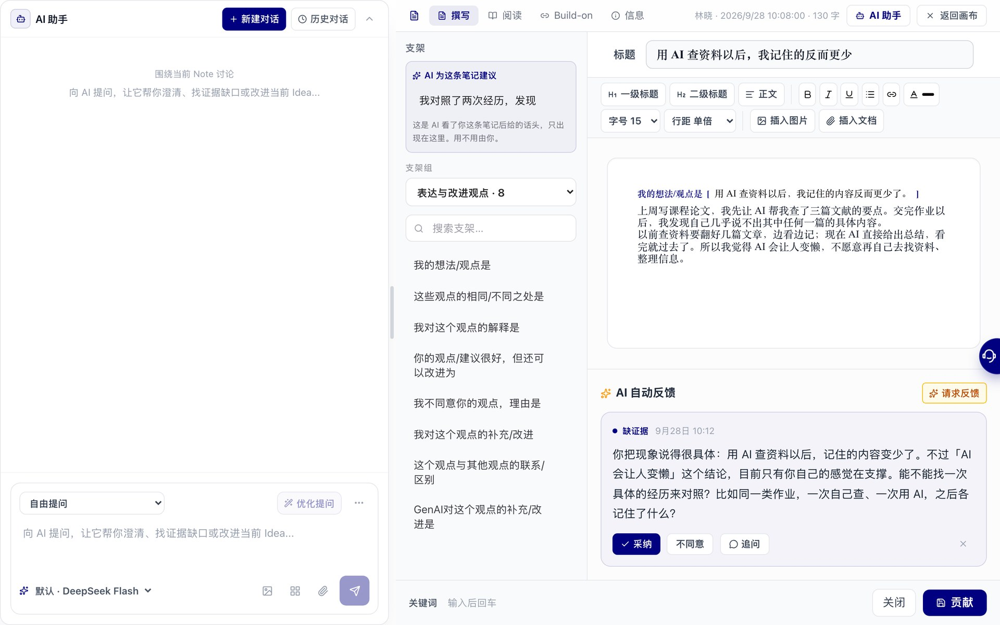

The Note editor keeps the student's writing beside scaffolds and contextual assistance.

### Teacher configuration

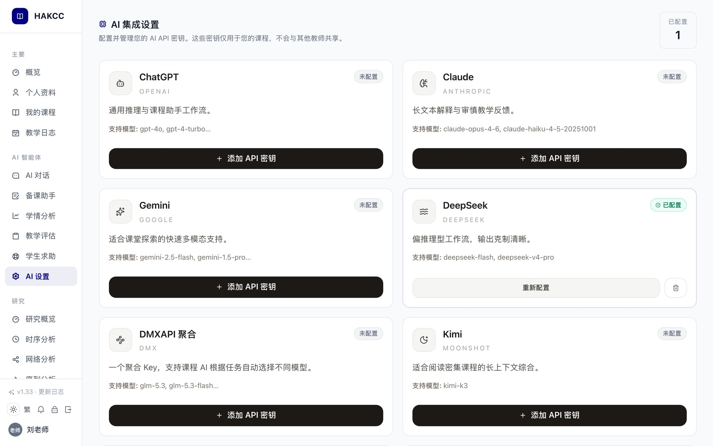

Teachers configure course AI support within the course administration interface. Provider secrets remain server-side.

### Build-on: clarify an existing idea

A student opens an existing contribution and writes a clarification linked to it.

### AI partnership: examine a response

A contextual conversation supplies material for examination. The scripted example distinguishes a published study from claims it did not test.

### Rise-above: write a synthesis from source Notes

Participants examine source Notes, discuss their relationship, and write the explanation they will publish.

## All mechanism figures

The nine mechanisms below explain the platform at complementary levels. Each has **English and Chinese PNG, SVG, and editable draw.io** versions. [Complete bilingual gallery](figure/README.md) · [Eighteen-page PDF](figure/HAKCC_mechanisms.pdf) · [Editable collection](figure/HAKCC_mechanisms.drawio).

### 01. System overview

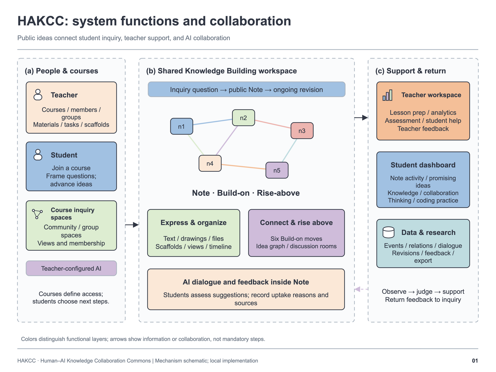

Courses connect the student workspace, teacher support, and bounded AI services. Shared ideas form the center of the platform.

### 02. Notes and Build-on discourse

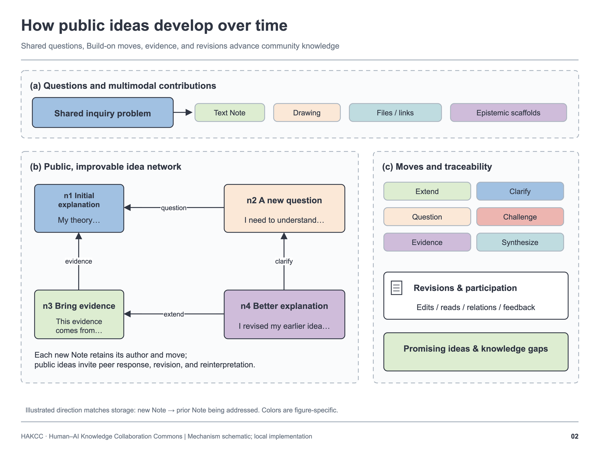

Students express an explanation in a Note and use six relation types to extend, clarify, question, challenge, provide evidence, or synthesize. Relations make the developing discourse inspectable.

### 03. AI partnership and selective uptake

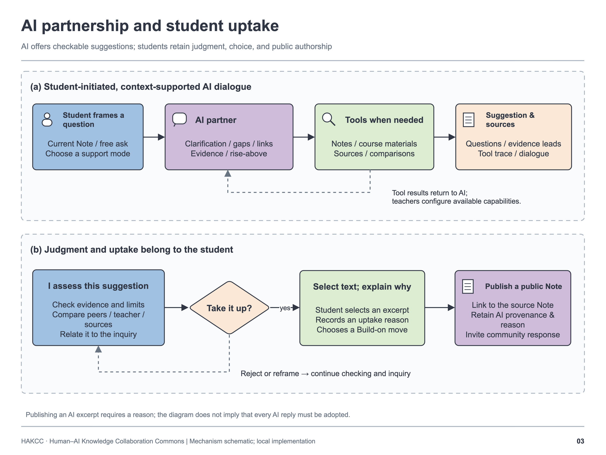

Students choose a partner role, examine a response, select useful excerpts, and supply an adoption reason. Conversation and message provenance accompany the selected contribution.

### 04. Source-visible Rise-above

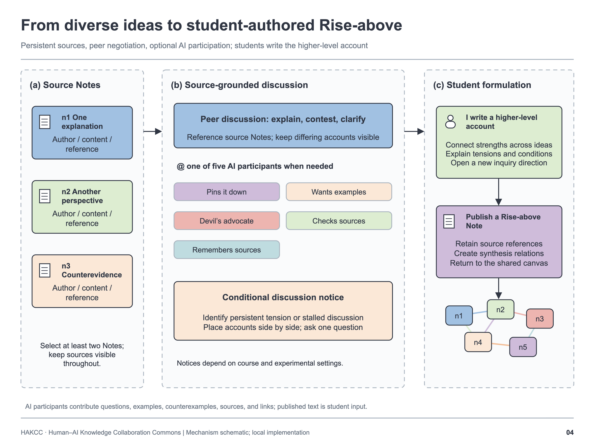

A discussion room keeps the selected source Notes available while participants develop a higher-level explanation. Participants supply the published synthesis; publication follows room and course permissions.

### 05. Teacher and student feedback

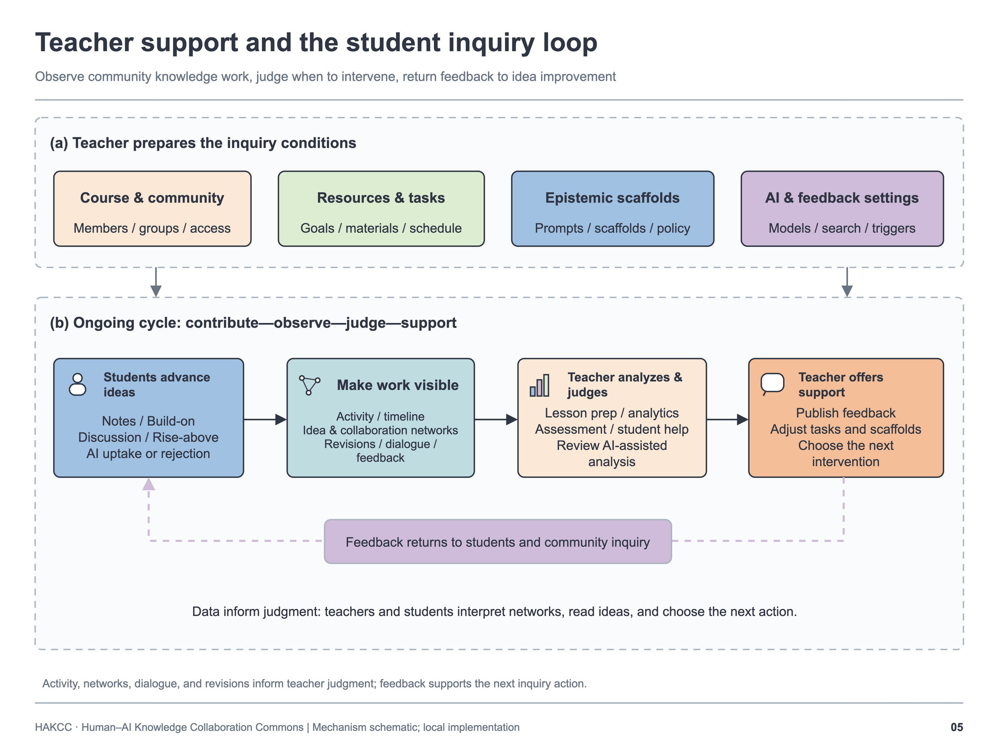

Students raise difficulties and teachers respond within the course. Activity and discourse views support decisions about further inquiry, participation, and assistance.

### 06. Agent tools and bounded execution

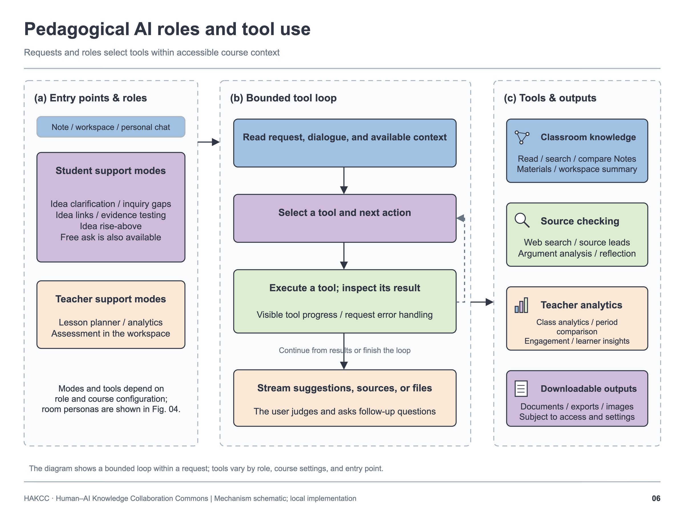

Role-specific tools retrieve permitted context and supply evidence leads. Server-side checks, tool budgets, and bounded loops constrain execution; the student judges the resulting suggestions.

### 07. Technical architecture

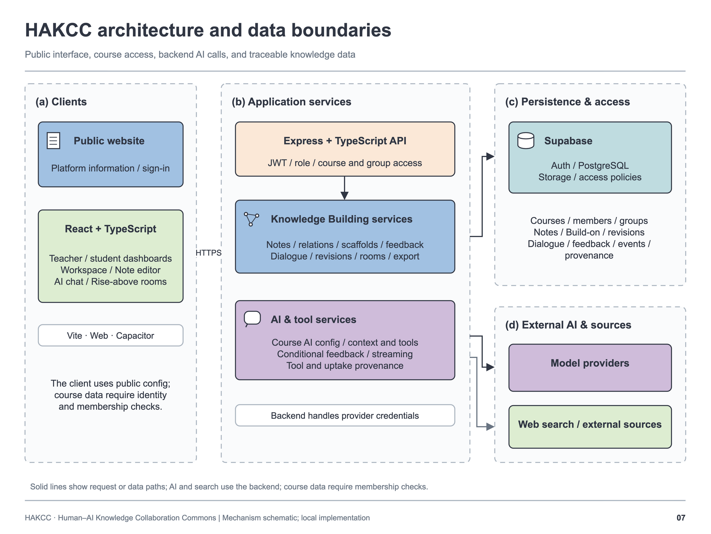

A React/TypeScript client calls an Express API. Supabase supplies identity and persistence; access policies and server-side provider configuration protect course boundaries.

### 08. Knowledge Building theory to design

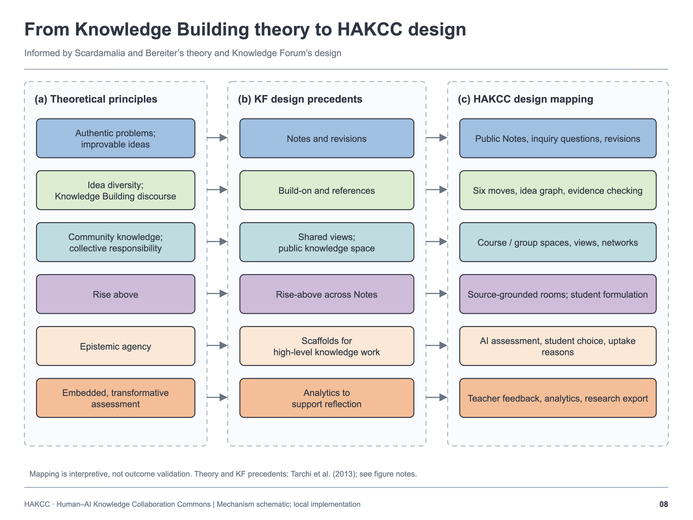

Selected KB principles are mapped to public ideas, discourse, student decisions, shared responsibility, and feedback. The theoretical guide discusses all twelve principles and credits their original authors.

### 09. Conditional AI feedback

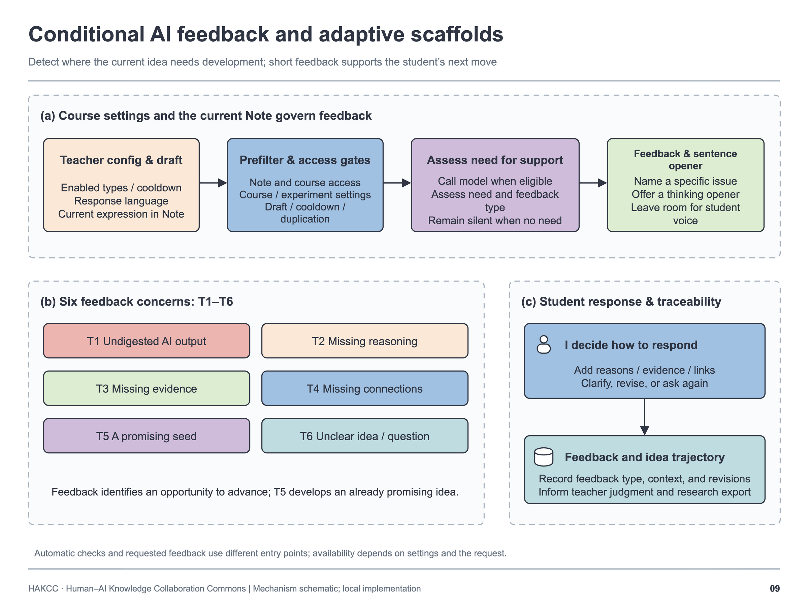

Course settings, membership, feedback categories, condition gates, deduplication, and cooldowns determine whether feedback is available. These are configurable software mechanisms, not evidence of educational effects.

## Knowledge Building and Knowledge Forum

The principal foundations are **Marlene Scardamalia and Carl Bereiter's Knowledge Building (KB)** work and **Knowledge Forum (KF)**. Notes, Views, Build-on, Scaffolds, and Rise-above have established KF precedents. HAKCC is an independent implementation; its configuration of AI partnership, reflective uptake, and source-visible synthesis is documented in [design contributions and attribution](ORIGINALITY_AND_ATTRIBUTION.md).

- **Knowledge Forum and its institution:** [IKIT](https://ikit.org/), [Knowledge Building International](https://ikit.org/kbi/), and [KF6 platform login](https://kf6.ikit.org/login). KF course access requires an account.
- **Scardamalia (2003):** *Knowledge Forum (advances beyond CSILE).* [Original article](https://ikit.org/fulltext/2003_KFAdvances.htm).
- **Scardamalia (2004):** *CSILE/Knowledge Forum®.* [Original chapter](https://ikit.org/fulltext/CSILE_KF.pdf).
- **Scardamalia & Bereiter (2006):** *Knowledge building: Theory, pedagogy, and technology.* [Original chapter](https://ikit.org/fulltext/2006_KBTheory.pdf).

The [theoretical guide](write/THEORETICAL_FOUNDATIONS.en.md) supplies full references and a twelve-principle KB design mapping. These intellectual sources explain the foundations, rather than validate HAKCC's learning effects or imply endorsement by their authors.

## Source, installation, and evidence

| Location | Contents |
| --- | --- |
| `App.tsx`, `components/`, `hooks/`, `contexts/`, `services/` | React/TypeScript web client |
| `api/src/` | Express API, access control, AI orchestration, and analysis services |
| `supabase/migrations/` | Historical SQL schema and policy migrations |
| `docker/` | Container definitions with configurable project credentials |
| [Getting started](GETTING_STARTED.md) | Environment configuration, builds, tests, and database limitations |
| [System guide](write/SYSTEM_OVERVIEW.en.md) | Teacher/student workflows and feature conditions |
| [Implementation evidence](write/IMPLEMENTATION_EVIDENCE.en.md) | Claims mapped to source files |
| [Development record](evidence/DEVELOPMENT_RECORD.md) | Source correspondence and SHA-256 manifests |
| [Release validation](evidence/RELEASE_VALIDATION.md) | Executed checks and known limitations |

Start with the installation guide. The migration archive contains deployment-era changes and has not been validated as a complete fresh database replay. See the validation record before using the snapshot as a deployment baseline.

## License and citation

Original code, documentation, and HAKCC diagrams are available under the **[MIT License](LICENSE)**. Third-party components retain their own licenses; see [rights and reuse](RIGHTS.md) and [third-party notices](THIRD_PARTY_NOTICES.md).

Use GitHub's **Cite this repository** action or [CITATION.cff](CITATION.cff):

> He, Z. (2026). *HAKCC: Human–AI Knowledge Collaboration Commons* (v0.3.0) [Software and design documentation]. https://github.com/Youn-17/HAKCC

[Authorship and acknowledgments](AUTHORS.md) records the public author and AI-assisted documentation preparation. Versioned publication and fingerprints support attribution and traceability; they do not certify worldwide invention priority.
