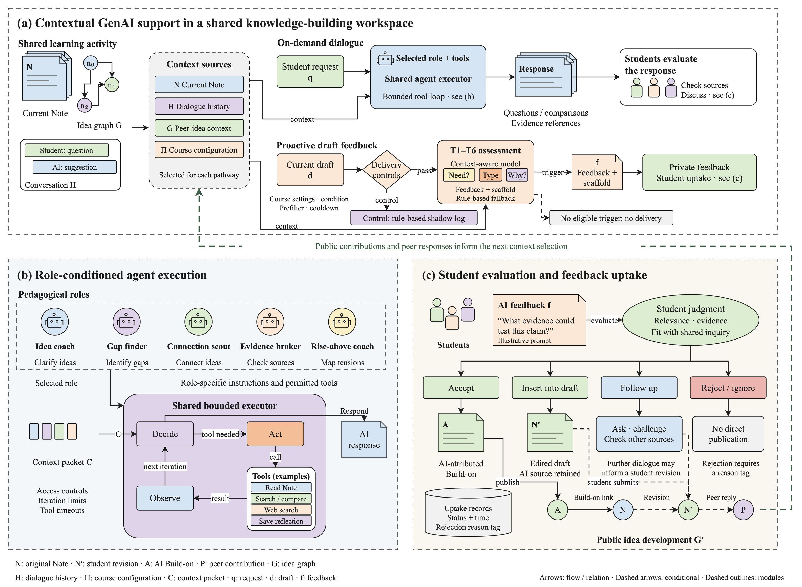
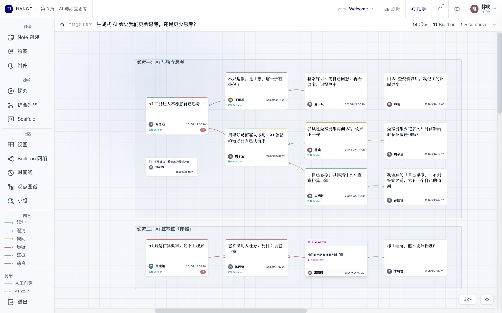
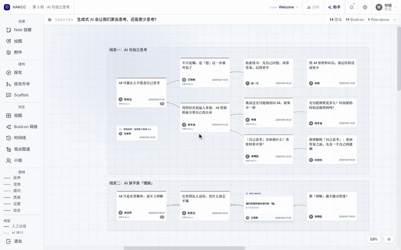
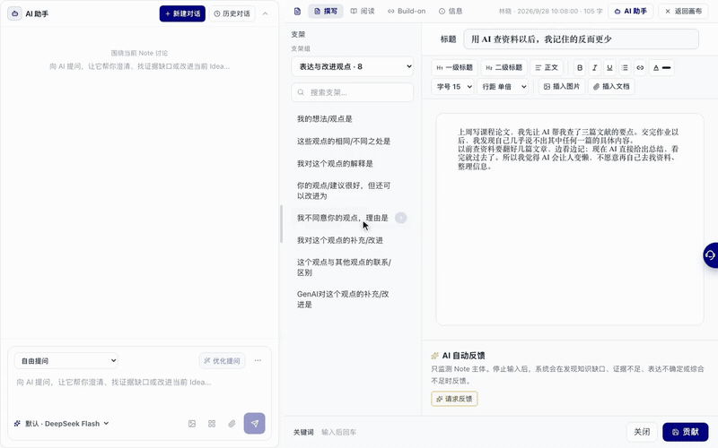
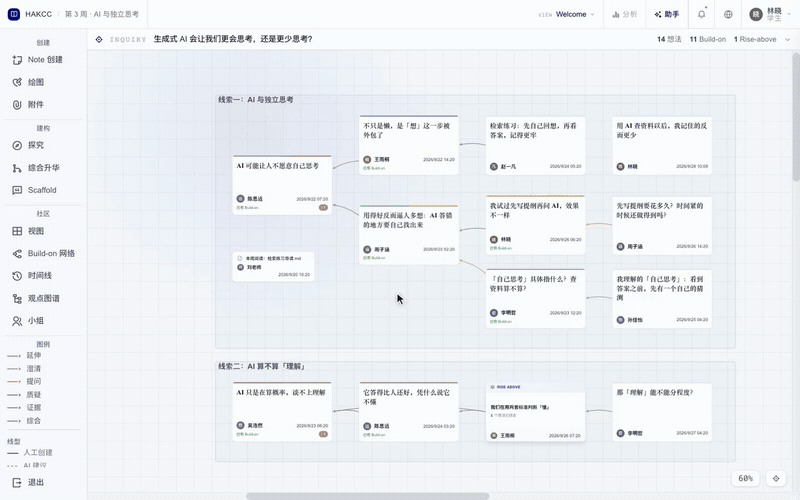

# HAKCC · 人智知识协作空间

[English](README.md) · [访问平台](https://ideaweave.tech/) · [系统说明](write/SYSTEM_OVERVIEW.md) · [MIT 开源许可证](LICENSE)

**作者与维护者：Zhenhai He（[Youn-17](https://github.com/Youn-17)）。** 本仓库开源应用代码、机制图和系统说明，英文为主、中文为辅。最新标签版本为 **v0.7.0**；`main` 分支包含后续源码更新。

## 本次更新 · v0.7.0

知识空间新增独立讨论分析页，提供词云、关键词变化、观点接力和待推进议题。支持视图、学生、日期筛选，查看来源 Note 并返回画布；新增可选的引用核对与草稿支架建议。

[功能、安装与限制](write/UPDATES_v0.7.0.md) · [English](write/UPDATES_v0.7.0.en.md)

## 上一版 · v0.5.0

知识空间与 Note AI 使用分页历史、持久化滚动记忆及当前学生在本课程中的相关记录提供指导。保留模型选择，按模型配置分配历史预算。个性化来自已保存情境的检索，未训练模型权重。

[记忆行为、数据流、限制与升级说明](write/UPDATES_v0.5.0.md) · [English](write/UPDATES_v0.5.0.en.md)

## 上一版 · v0.4.0

课程材料检索接入 Note 与知识空间 AI，显示来源卡片和可用 PDF 页码；教师可以控制检索材料、重新解析和测试问题。附件须配合文字问题，失败时恢复问题与附件，历史对话匹配助手与课程。

[本次补充说明与升级要求](write/UPDATES_v0.4.0.md) · [完整英文说明](write/UPDATES_v0.4.0.en.md)

## 上一版 · v0.3.0

新增知识地图、构建时间线与序列回放，改进反馈采纳与原 Note 修订流程，增加 AI 工具步骤显示、回答长度偏好、讨论主题、可选 Jev 判断和教师求助路径。

[详细补充说明、操作与升级要求](write/UPDATES_v0.3.0.md) · [完整英文说明](write/UPDATES_v0.3.0.en.md)

## 整体机制

这张图把情境支持、有界 AI 伙伴与学生对反馈的判断连接起来，放在机制介绍的开头。学生定义问题、检验证据、选择采纳或拒绝建议，并撰写进入共同体的观点。

学生通过 **Note** 表达可改进的解释，通过 **Build-on** 延伸、澄清、提问、质疑、补充证据和综合，通过 **Rise-above** 讨论形成更高层次的解释。教师管理课程、任务与材料，并结合过程信息支持共同体探究。AI 的建议由学生判断和使用。

## 截图与动态演示

下列素材均为**本地虚构课程与人物数据**，使用真实界面和模拟接口，AI 回复由脚本生成；动图以 1.5 倍速度播放。它们用于解释操作，不是课堂研究数据或效果证据。

[完整截图与素材说明](media/README.md)。公开主页为 [ideaweave.tech](https://ideaweave.tech/)，课程空间需要账号与成员权限。

## 全部机制图与详细说明

[中英文机制图册首页](figure/README.md) 直接展示整体图与九组双语机制图，提供 PNG、SVG、可编辑 draw.io 和十八页合集 PDF。英文仓库首页也直接展示九张英文机制图。

- [中文系统说明](write/SYSTEM_OVERVIEW.md) / [English system guide](write/SYSTEM_OVERVIEW.en.md)
- [中文理论基础](write/THEORETICAL_FOUNDATIONS.md) / [English theoretical foundations](write/THEORETICAL_FOUNDATIONS.en.md)
- [安装与验证](GETTING_STARTED.md)
- [设计贡献与理论归属](ORIGINALITY_AND_ATTRIBUTION.md)
- [开发记录及内容指纹](evidence/DEVELOPMENT_RECORD.md)
- [发布验证与已知限制](evidence/RELEASE_VALIDATION.md)

## KF 平台与参考来源

KB 理论主要来自 **Marlene Scardamalia 与 Carl Bereiter**，Note、View、Build-on、Scaffold 和 Rise-above 的软件设计参照为 **Knowledge Forum**。

- [IKIT 官方网站](https://ikit.org/) · [Knowledge Building International](https://ikit.org/kbi/) · [KF6 平台入口](https://kf6.ikit.org/login)
- Scardamalia (2003)：[Knowledge Forum (advances beyond CSILE)](https://ikit.org/fulltext/2003_KFAdvances.htm)
- Scardamalia (2004)：[CSILE/Knowledge Forum®](https://ikit.org/fulltext/CSILE_KF.pdf)
- Scardamalia 与 Bereiter (2006)：[Knowledge building: Theory, pedagogy, and technology](https://ikit.org/fulltext/2006_KBTheory.pdf)

完整书目信息见理论基础文档。HAKCC 是独立实现，不代表 KF 官方版本或上述作者的认可。功能和机制图不构成已证实的教学效果。

## 开源与引用

原始代码、文档与 HAKCC 图稿使用 **[MIT 许可证](LICENSE)**，保留版权与许可说明即可按许可证使用、修改和分发；第三方组件遵循各自许可。[作者说明](AUTHORS.md) · [引用元数据](CITATION.cff) · [权利与复用](RIGHTS.md)。

发布包不包含真实课程数据、密钥、运维账户信息、未公开论文或参考图原件。版本记录与文件指纹支持核查公开内容及时间，不独立证明全部机制的最早发明权。

本次更新：[讨论分析](write/UPDATES_v0.7.0.md)。

当前 `main` 源码的自定讨论主题需要在已有兼容数据库上执行 `supabase/migrations/087_space_analytics_topics.sql`。迁移归档尚未验证为可完整重放的新库初始化流程。
