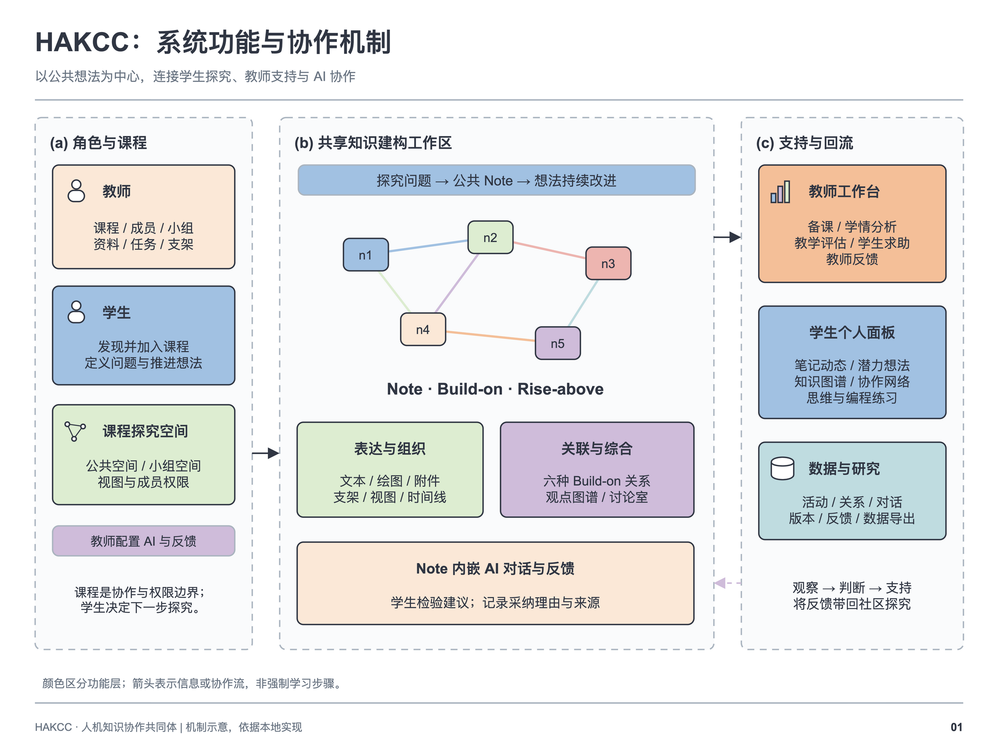
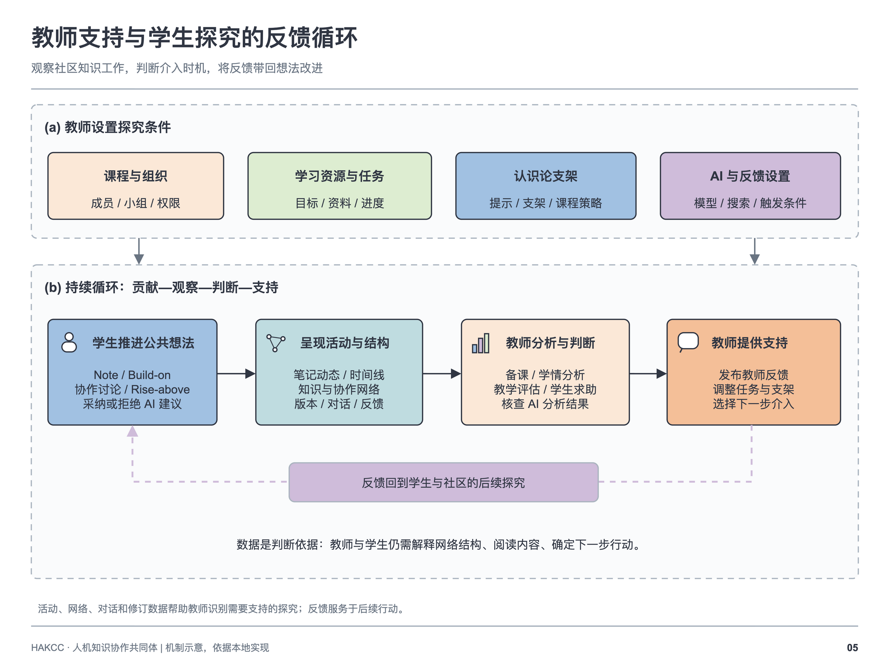
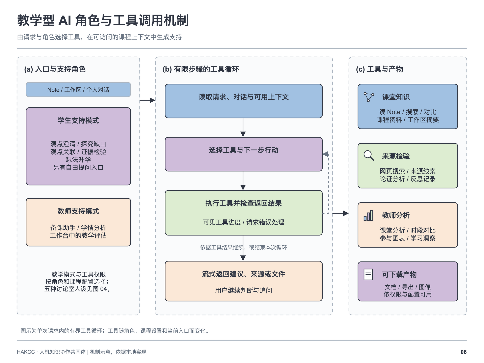

# HAKCC mechanism gallery

[Home](../README.md) · [System guide](../write/SYSTEM_OVERVIEW.en.md) · [Theoretical references](../write/THEORETICAL_FOUNDATIONS.en.md)

## Integrated mechanism overview

This overview connects contextual support, bounded AI roles, and student feedback uptake. It is supplied as a [full-resolution PNG](HAKCC_Mechanism.png) and [editable draw.io document](HAKCC_Mechanism.drawio). The nine mechanisms below provide complementary views, each in English and Chinese with editable draw.io sources. [Figure sources and scope](SOURCE_NOTES.md).

[Editable eighteen-page collection](HAKCC_mechanisms.drawio) · [Eighteen-page PDF](HAKCC_mechanisms.pdf). The collection contains the nine bilingual diagrams; the integrated overview is a separate image.

## 01. System overview · 系统总览

Courses connect the student workspace, teacher support, and bounded AI services. Shared ideas form the center of the platform.

### English

[PNG](en/01_system_overview.png) · [SVG](en/01_system_overview.svg) · [Editable draw.io](en/01_system_overview.drawio)

### 中文

[PNG](zh/01_system_overview.png) · [SVG](zh/01_system_overview.svg) · [可编辑 draw.io](zh/01_system_overview.drawio)

## 02. Notes and Build-on discourse · Note 与 Build-on

Students express an explanation in a Note and use six relation types to extend, clarify, question, challenge, provide evidence, or synthesize. Relations make the developing discourse inspectable.

### English

[PNG](en/02_knowledge_building.png) · [SVG](en/02_knowledge_building.svg) · [Editable draw.io](en/02_knowledge_building.drawio)

### 中文

[PNG](zh/02_knowledge_building.png) · [SVG](zh/02_knowledge_building.svg) · [可编辑 draw.io](zh/02_knowledge_building.drawio)

## 03. AI partnership and selective uptake · AI 伙伴与选择性采纳

Students choose a partner role, examine a response, select useful excerpts, and supply an adoption reason. Conversation and message provenance accompany the selected contribution.

### English

[PNG](en/03_ai_partner_and_uptake.png) · [SVG](en/03_ai_partner_and_uptake.svg) · [Editable draw.io](en/03_ai_partner_and_uptake.drawio)

### 中文

[PNG](zh/03_ai_partner_and_uptake.png) · [SVG](zh/03_ai_partner_and_uptake.svg) · [可编辑 draw.io](zh/03_ai_partner_and_uptake.drawio)

## 04. Source-visible Rise-above · 源观点可见的 Rise-above

A discussion room keeps the selected source Notes available while participants develop a higher-level explanation. Participants supply the published synthesis; publication follows room and course permissions.

### English

[PNG](en/04_rise_above_discussion.png) · [SVG](en/04_rise_above_discussion.svg) · [Editable draw.io](en/04_rise_above_discussion.drawio)

### 中文

[PNG](zh/04_rise_above_discussion.png) · [SVG](zh/04_rise_above_discussion.svg) · [可编辑 draw.io](zh/04_rise_above_discussion.drawio)

## 05. Teacher and student feedback · 师生反馈

Students raise difficulties and teachers respond within the course. Activity and discourse views support decisions about further inquiry, participation, and assistance.

### English

[PNG](en/05_teacher_student_feedback.png) · [SVG](en/05_teacher_student_feedback.svg) · [Editable draw.io](en/05_teacher_student_feedback.drawio)

### 中文

[PNG](zh/05_teacher_student_feedback.png) · [SVG](zh/05_teacher_student_feedback.svg) · [可编辑 draw.io](zh/05_teacher_student_feedback.drawio)

## 06. Agent tools and bounded execution · 代理工具与有界执行

Role-specific tools retrieve permitted context and supply evidence leads. Server-side checks, tool budgets, and bounded loops constrain execution; the student judges the resulting suggestions.

### English

[PNG](en/06_agent_tool_mechanism.png) · [SVG](en/06_agent_tool_mechanism.svg) · [Editable draw.io](en/06_agent_tool_mechanism.drawio)

### 中文

[PNG](zh/06_agent_tool_mechanism.png) · [SVG](zh/06_agent_tool_mechanism.svg) · [可编辑 draw.io](zh/06_agent_tool_mechanism.drawio)

## 07. Technical architecture · 技术架构

A React/TypeScript client calls an Express API. Supabase supplies identity and persistence; access policies and server-side provider configuration protect course boundaries.

### English

[PNG](en/07_technical_architecture.png) · [SVG](en/07_technical_architecture.svg) · [Editable draw.io](en/07_technical_architecture.drawio)

### 中文

[PNG](zh/07_technical_architecture.png) · [SVG](zh/07_technical_architecture.svg) · [可编辑 draw.io](zh/07_technical_architecture.drawio)

## 08. Knowledge Building theory to design · 知识建构理论与设计

Selected KB principles are mapped to public ideas, discourse, student decisions, shared responsibility, and feedback. The theoretical guide discusses all twelve principles and credits their original authors.

### English

[PNG](en/08_theory_to_design.png) · [SVG](en/08_theory_to_design.svg) · [Editable draw.io](en/08_theory_to_design.drawio)

### 中文

[PNG](zh/08_theory_to_design.png) · [SVG](zh/08_theory_to_design.svg) · [可编辑 draw.io](zh/08_theory_to_design.drawio)

## 09. Conditional AI feedback · 条件化 AI 反馈

Course settings, membership, feedback categories, condition gates, deduplication, and cooldowns determine whether feedback is available. These are configurable software mechanisms, not evidence of educational effects.

### English

[PNG](en/09_conditional_ai_feedback.png) · [SVG](en/09_conditional_ai_feedback.svg) · [Editable draw.io](en/09_conditional_ai_feedback.drawio)

### 中文

[PNG](zh/09_conditional_ai_feedback.png) · [SVG](zh/09_conditional_ai_feedback.svg) · [可编辑 draw.io](zh/09_conditional_ai_feedback.drawio)

## Reading the figures

Availability depends on role, course, and service configuration. The figures summarize platform capabilities and their KB interpretation; they are not reports of validated effects. Figure 08 groups selected principles; the theoretical guide discusses all twelve.

Knowledge Forum is the intellectual/software precedent for Notes, Views, Build-on, Scaffolds, and Rise-above. See [Scardamalia (2003)](https://ikit.org/fulltext/2003_KFAdvances.htm), [Scardamalia (2004)](https://ikit.org/fulltext/CSILE_KF.pdf), [IKIT](https://ikit.org/), and [KF6](https://kf6.ikit.org/login).
