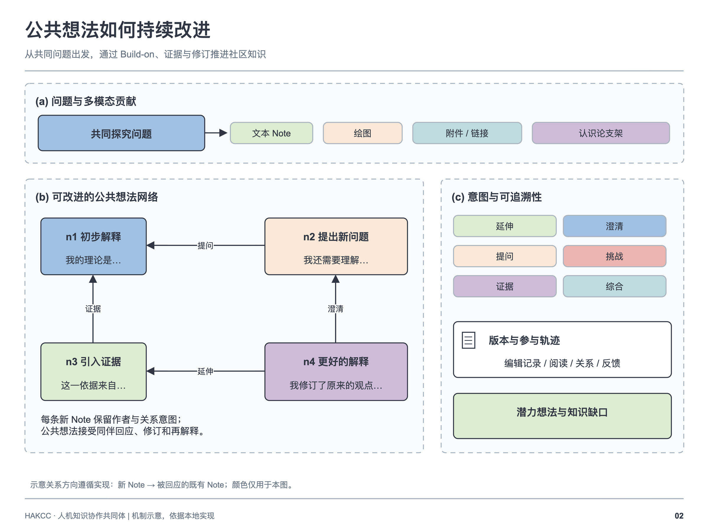
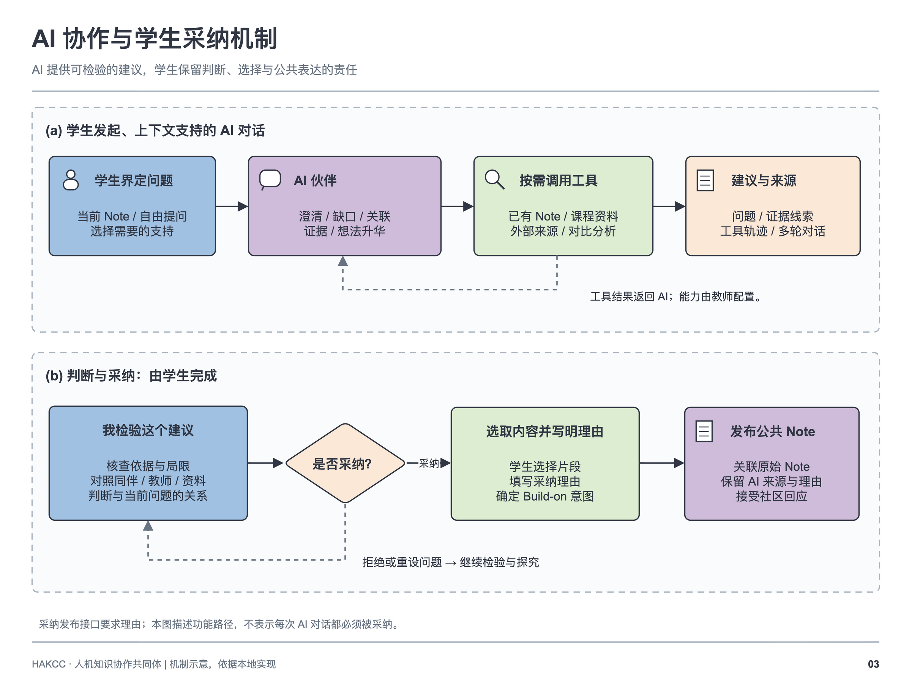
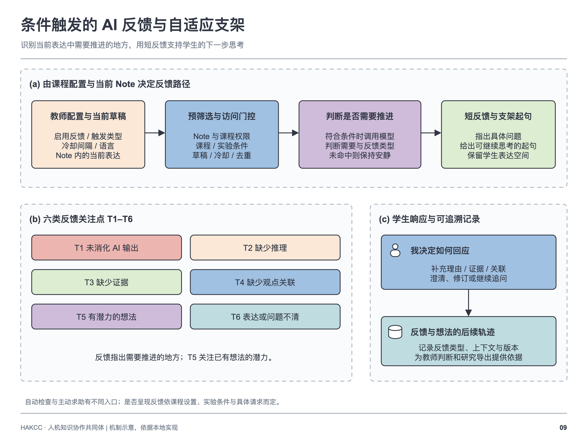
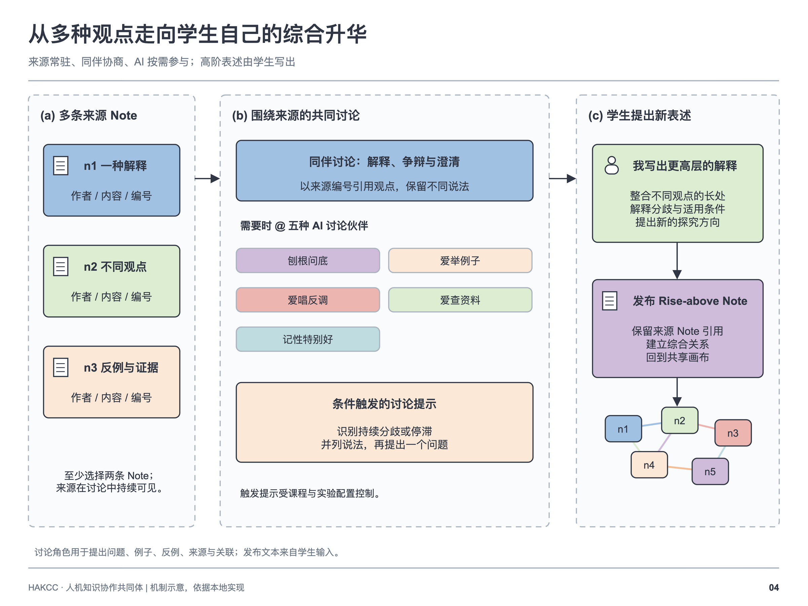
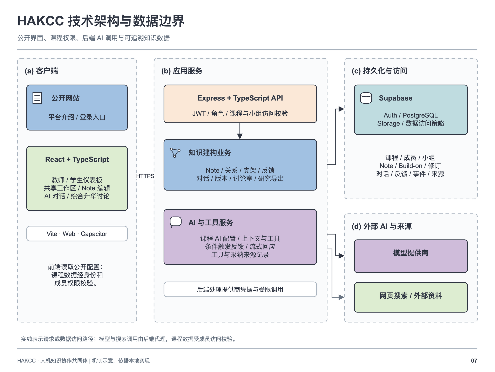

# HAKCC 系统说明

Current feature and upgrade supplement: [English](UPDATES_v0.4.0.en.md) · [中文](UPDATES_v0.4.0.md).
公开访问：[ideaweave.tech](https://ideaweave.tech/) · [首页](../README.zh-CN.md) · [理论基础](THEORETICAL_FOUNDATIONS.md)

HAKCC 将课程中的观点、讨论、证据和反思组织成可持续改进的共同知识空间。它的基本单位是 **Note**：一个可以被阅读、修订、关联和继续建构的观点对象。平台围绕课程与社区组织协作，AI 的建议需要回到学生的理解与共同体的探究中。

## 1. 课程、社区与身份

登录后，用户从课程列表进入知识空间。课程可以包含多个 View、小组、学习目标、资料、任务与教学安排。平台身份包括学生、教师和管理员；课程还区分成员与具有管理权限的工作人员。教师身份本身不会赋予其所有课程的管理权限。

学生参与观点表达、阅读、Build-on、AI 对话、综合升华和自我反思。教师组织课程、配置支持、观察共同体的知识工作，并处理学生求助。管理员维护平台层面的权限和配置。课程设置中的学习目标目前用于教师备课，课程资料列表用于教师管理与 AI 检索；学生阅读原文的入口是知识空间中发布的附件。

## 2. 共享知识工作台

工作台用卡片与关系线呈现观点。用户可以创建文字 Note、绘图和附件，用多个 View 组织不同探究线索，通过时间线、Build-on 网络与观点图谱检查讨论如何发展。探究问题帮助成员把分散的发言联系到共同需要理解的问题。

Note 编辑器支持标题、正文、关键词、格式、图片和文档。Scaffold（支架）用句首提示帮助用户明确正在进行的知识活动，例如解释、提出不确定之处、检验 AI 回答或整合观点。支架的可用组与要求由课程配置决定。

## 3. Build-on：对已有观点作出贡献

Build-on 将新 Note 关联到已有 Note，并说明贡献的性质：

| 关系 | 典型用途 |
| --- | --- |
| 延伸 | 增加解释、条件或新的推论 |
| 澄清 | 明确术语、范围或容易误解之处 |
| 提问 | 提出尚未解释的问题 |
| 质疑 | 检查假设、反例或解释冲突 |
| 证据 | 引入能够支持或检验观点的材料 |
| 综合 | 连接多个观点，形成新的理解 |

例如，一条 Note 提出“AI 可以做到因材施教”，另一条可以追问“如何判断学生真正理解了”。后续成员可以补充研究证据、提出限制条件，再将这些线索综合为更精确的解释。关系线让读者看到这些贡献之间的联系。

## 4. AI 伙伴与学生采纳

AI 可以围绕当前 Note、知识空间或个人任务参与对话。除自由提问外，学生侧的五种教学 Agent 模式包括观点澄清、探究缺口、观点关联、证据检验和观点提升。不同入口与角色可使用的工具有所区别。

AI 的上下文可以包括获准访问的 Note、相关讨论与课程材料。工具支持观点检索、论证分析、资料检索、联网证据和反思等活动；教师侧还支持备课与学情分析。工具调用在一轮请求内完成，并受角色、课程权限和工具配置约束。

学生可以选择 AI 回复中的片段，并填写采纳理由，再将其作为贡献带回知识空间。系统保留来源对话、消息及相关模型信息，便于理解内容是如何形成的。学生也可以不采纳、进一步提问或改写建议。一次对话并不自动等于共同体知识的改进。

联网检索、图像生成、不同模型及自动反馈是否可用，取决于课程和服务配置。界面中的“未配置 AI 服务”意味着该入口当前不能完成真实模型调用。

## 5. 条件性的 AI 反馈

Note 自动反馈围绕正文展开。启用后，系统在输入停顿等条件下检查观点是否需要进一步推进，关注未消化的 AI 内容、推理缺口、证据不足、观点关联不足、有潜力的线索或表达不清等情况。反馈可以邀请用户继续解释或提出下一步问题。

实际调用受课程开关、访问权限、实验条件、请求去重和冷却机制影响。用户主动请求反馈与系统自动检查有各自的入口及条件。反馈结果供学生判断与回应，不能作为自动评分或学习成效的证明。

## 6. Rise-above：从多条观点走向新的理解

用户选择至少两条源 Note 进入综合升华讨论室。源观点保持可见，小组成员讨论其联系、冲突和未解决的问题，并可邀请不同 AI 讨论角色参与。AI 可以帮助追问、举例、提出反例、检查来源或连接已有观点。

最终综合的标题和正文由参与者撰写；讨论室创建者或具有课程管理权限的工作人员可以发布。发布的 Rise-above 保留到源 Note 的综合关系。这里的目标是形成能够推进探究的理解；将几条 Note 拼接或自动压缩成摘要，并不能替代学生的综合工作。

## 7. 教师端

| 区域 | 教师工作 |
| --- | --- |
| 课程设置 | 管理学习目标、材料、任务、教学安排及协作权限 |
| 课程工作台 | 阅读观点、组织 View、管理成员与支架，参与知识讨论 |
| AI 支持 | AI 对话、备课助手、学情分析和教学评估 |
| 学生支持 | 查看学生求助与反馈，定位需要进一步支持的讨论 |
| 研究工具 | 时序、网络、序列、话语与参与分析，质性编码，数据导出 |

分析结果应回到教学判断与共同体反思中：哪些问题仍未解释，哪些观点值得推进，哪些成员还没有获得参与机会。Note 数量与关系数量反映活动结构，不能单独代表理解质量。

## 8. 学生端

一个常见的参与过程是：进入课程 → 阅读共同问题与相关 Note → 用自己的解释创建 Note → 用 Build-on 回应同伴 → 与 AI 讨论或检验资料 → 判断并改进观点 → 参与 Rise-above → 反思共同体下一步应做什么。

个人学习区域提供 Note 活动、知识关系、有潜力的观点、思维发展、协作、反馈与 AI 等入口。具体可见页面与数据由角色、课程配置及实际活动决定。

## 9. 数据与技术架构

Web 客户端使用 React、TypeScript 与 Vite，Express API 处理课程、Note、关系、AI 请求与分析。Supabase 提供身份认证、PostgreSQL 数据与文件存储。AI 供应商请求通过后端服务执行，前端不应持有供应商密钥。

研究导出支持 Note、关系、参与者、对话消息、AI 反馈与介入、事件、Note 修订、求助和课次等数据集。导出服务默认使用参与者编码；包含真实姓名需要显式选择。研究者仍需依据实际研究范围解释记录，并对所导出的材料负责。

## 10. 使用与阅读

1. 打开 [ideaweave.tech](https://ideaweave.tech/)，登录自己的账号。
2. 进入已加入的课程，先确认共同探究问题和当前 View。
3. 阅读一条 Note，思考自己的贡献与其关系，再创建或 Build-on。
4. 需要帮助时使用支架、AI 伙伴或向教师求助。
5. 将证据、修改和反思带回共同知识空间。

理论依据见[理论基础与参考文献](THEORETICAL_FOUNDATIONS.md)。本说明依据 2026-10-04 检查的当前实现编写；实际在线演示范围另行记录，功能可能受课程配置影响。
