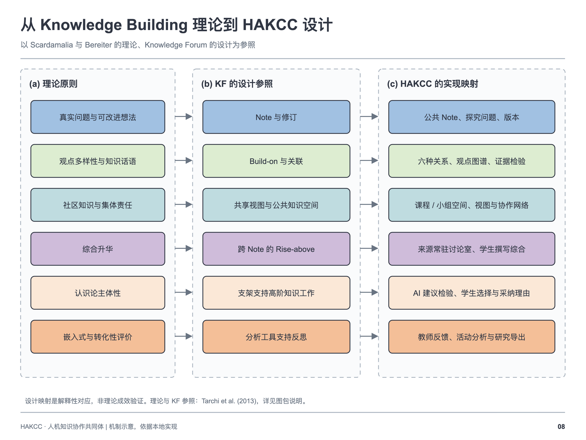

# 理论基础：Knowledge Building、Knowledge Forum 与 HAKCC

[系统说明](SYSTEM_OVERVIEW.md) · [中文首页](../README.zh-CN.md)

## Knowledge Building 的核心

Marlene Scardamalia 与 Carl Bereiter 的 Knowledge Building（KB）关注共同体持续改进其公开知识。学生参与提出问题、发展解释、检验证据和决定下一步探究，对共同知识承担责任。个人学习与共同知识推进相互联系。[Scardamalia & Bereiter, 2006](https://ikit.org/fulltext/2006_KBTheory.pdf)

Scardamalia 的集体认知责任概念强调：高层次的知识工作应成为成员共同承担的工作，学生参与判断什么值得理解、哪些解释仍不足以及如何推进。[Scardamalia, 2002](https://ikit.org/fulltext/inpressCollectiveCog.pdf)

## Knowledge Forum 的设计来源

Knowledge Forum（KF）用 Note 表达观点，用 View 组织共同知识空间；Build-on 连接后续贡献，Scaffold 支持知识话语，Rise-above 支持超越分散观点的综合。这些设计使知识形成过程可见，并让成员继续改进共同知识。[Scardamalia, 2003](https://ikit.org/fulltext/2003_KFAdvances.htm)

HAKCC 采用相同的核心领域语言，并加入 AI 对话、来源可追溯的采纳、条件反馈和讨论室等机制。下面的对应关系是 **HAKCC 的设计解释**，并非原文献对生成式 AI 的实证结论。

## KB 原则与平台设计的对应

十二项原则的名称依据 KB/KF 教学技术导论整理。[Tarchi et al., 2013](https://ikit.org/knowledgebuilding/collaboratory/wp-content/uploads/2018/05/Knowledge-building-and-knowledge-forum-getting-started-with-pedagogy-and-technology.pdf)

| KB 原则 | HAKCC 的设计对应 | 可以观察的知识工作 |
| --- | --- | --- |
| 真实观点与真实问题（Real ideas, authentic problems） | 课程共同问题、Note 与探究入口 | 学生提出自己需要理解的问题 |
| 可改进的观点（Improvable ideas） | Note 修订、Build-on、反馈 | 对原解释作出具体改进 |
| 观点多样性（Idea diversity） | 多个 Note、View 与关系类型 | 保留并比较不同解释 |
| 综合升华（Rise above） | 源 Note 可见的讨论室与综合关系 | 提出能够连接或解释分歧的新观点 |
| 认知主体性（Epistemic agency） | 学生选择问题、AI 模式、采纳内容和理由 | 学生说明自己接受、拒绝或修改建议的依据 |
| 社区知识与集体责任（Community knowledge, collective responsibility） | 共享工作台与贡献关系 | 成员推进同伴和共同体的理解 |
| 知识民主化（Democratizing knowledge） | 多成员参与、小组协作与参与分析 | 让更多成员贡献和改进观点 |
| 对称的知识进步（Symmetric knowledge advancement） | 跨观点和小组的联系 | 将一组的发现带入另一条探究线索 |
| 无处不在的知识建构（Pervasive knowledge building） | 持续访问课程知识空间与多媒体资料 | 在不同课次之间延续问题 |
| 建设性使用权威来源（Constructive uses of authoritative sources） | 课程材料、证据关系与检索工具 | 用资料支持、质疑或修订解释 |
| 知识建构话语（Knowledge building discourse） | 六类 Build-on 与小组讨论 | 对话产生新的问题和解释 |
| 同步、嵌入、变革性的评价（Concurrent, embedded, transformative assessment） | 过程反馈、修订与研究分析 | 评价帮助决定下一步如何改进 |

## AI 如何进入这一设计

HAKCC 将 AI 作为可被学生追问、检验和重新配置的资源。学生首先表达自己的问题与解释，然后判断 AI 的建议是否适合当前探究。选取内容时填写理由，使采纳成为可反思的决定；来源关系帮助教师和同伴理解这一决定的背景。

Rise-above 保留源观点并由学生撰写综合，帮助维护学生对共同体知识推进的责任。AI 可以提出问题和证据线索，学生决定这些线索如何进入公共观点。是否促进认知主体性，需要结合实际互动、修订、采纳理由和共同体讨论开展研究。

## 使用理论时的边界

KB 是教学与知识工作的取向，KF 是支持这种取向的软件环境。拥有 Note、关系线或 AI 并不能自动构成高质量知识建构。平台能力、课堂实施过程与研究发现应分别报告。这里列出的文献说明理论来源，不能作为 HAKCC 已产生学习成效的证据。

HAKCC 为独立平台。本材料不声称其是 Knowledge Forum 的官方版本，也不声称获得 Scardamalia、Bereiter 或 IKIT 的认可。

## Knowledge Forum 平台网址

[IKIT 官方网站](https://ikit.org/) 提供 KF/KB 信息与文献，[Knowledge Building International](https://ikit.org/kbi/) 介绍相关共同体，[KF6 平台入口](https://kf6.ikit.org/login) 用于账号访问。课程参与需要权限。链接核对日期：2026-10-04。

## 参考文献

Scardamalia, M. (2002). Collective cognitive responsibility for the advancement of knowledge. In B. Smith (Ed.), *Liberal education in a knowledge society* (pp. 76–98). Open Court. [作者全文](https://ikit.org/fulltext/inpressCollectiveCog.pdf).

Scardamalia, M. (2003). Knowledge Forum (advances beyond CSILE). *Journal of Distance Education, 17*(Suppl. 3, Learning Technology Innovation in Canada), 23–28. [作者全文](https://ikit.org/fulltext/2003_KFAdvances.htm).

Scardamalia, M. (2004). CSILE/Knowledge Forum®. In *Education and technology: An encyclopedia* (pp. 183–192). ABC-CLIO. [Original chapter](https://ikit.org/fulltext/CSILE_KF.pdf).

Scardamalia, M., & Bereiter, C. (2006). Knowledge building: Theory, pedagogy, and technology. In R. K. Sawyer (Ed.), *The Cambridge handbook of the learning sciences* (pp. 97–118). Cambridge University Press. [作者全文](https://ikit.org/fulltext/2006_KBTheory.pdf).

Tarchi, C., Chuy, M., Donoahue, Z., Stephenson, C., Messina, R., & Scardamalia, M. (2013). Knowledge building and Knowledge Forum: Getting started with pedagogy and technology. *LEARNing Landscapes, 6*(2), 385–407. [全文](https://ikit.org/knowledgebuilding/collaboratory/wp-content/uploads/2018/05/Knowledge-building-and-knowledge-forum-getting-started-with-pedagogy-and-technology.pdf).
