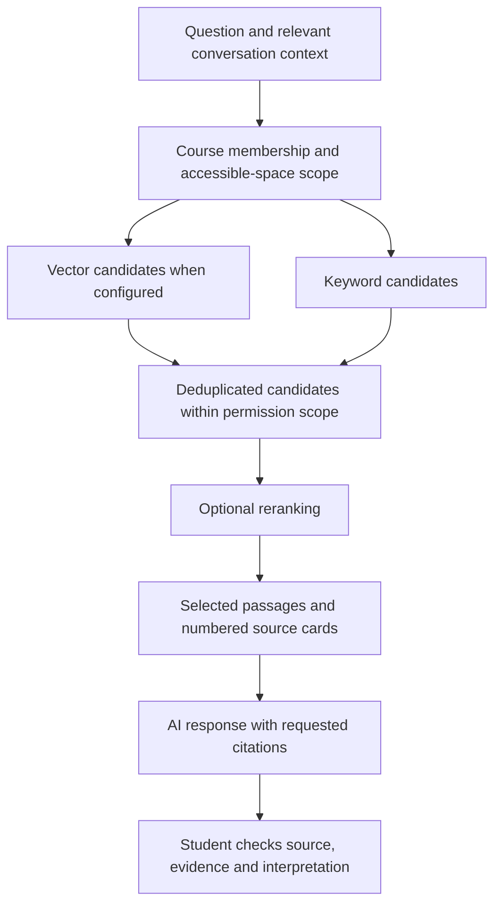

# HAKCC v0.4.0: course knowledge base and source tracing

[Home](../README.md) · [中文补充说明](UPDATES_v0.4.0.md) · [Previous update](UPDATES_v0.3.0.en.md) · [Validation](../evidence/RELEASE_VALIDATION.md)

**Zhenhai He · 7 October 2026.** This public snapshot brings course-material retrieval into Note and workspace AI conversations, gives teachers knowledge-base controls, and improves attachments, conversation continuity and process summaries. The inspected snapshot includes committed development changes and working-tree changes; the file manifests identify the exact published bytes.

## Changes from v0.3.0

| Area | Observable behavior | Implementation |
| --- | --- | --- |
| Course-material retrieval | Note and workspace AI can retrieve relevant passages before answering; short follow-up questions gain context from earlier questions and the Note title | [query context](../api/src/services/kbQuery.ts), [retrieval](../api/src/services/knowledgeBase.ts), [source integration](../api/src/services/kbSources.ts) |
| Source cards and page references | Answers can cite numbered passages; cards display file title, section, excerpt and available PDF pages | [citation registry](../api/src/services/kbSources.ts), [source cards](../components/KbSourceCards.tsx), [page mapping](../api/src/services/pageMap.ts) |
| Teacher knowledge-base management | Per-material inclusion, course-wide workspace-attachment inclusion, re-parsing, search tests and a processing/retrieval overview | [teacher panel](../components/courseSettings/CourseKnowledgeBase.tsx), [authorized routes](../api/src/routes/courseKnowledgeBase.ts) |
| Background processing | Persistent pending vectors, bounded batches/retries and periodic parse sweeps; retrieval uses compatible model/dimension identities | [vector jobs](../api/src/services/kbVectorJob.ts), [material ingestion](../api/src/services/kbIngest.ts) |
| Attachments | A typed question is required; images/documents reach the workspace AI path; failed sends restore the question and attachments for retry | [shared rules](../components/chatAttachments.ts), [workspace route](../api/src/routes/workspaceAgent.ts) |
| Conversation continuity | Reuse respects the selected assistant and course; personal conversation history reads the latest 100 messages | [history matching](../components/workspaceAgentHistory.ts), [personal assistant](../api/src/routes/personalAgent.ts) |
| Process summaries and files | Build-on counts and chain summaries are corrected; generated reports use backend charts and retain text when chart rendering fails | [agent tools](../api/src/services/agentTools.ts), [file generation](../api/src/services/fileGenerator.ts) |
| Canvas loading and teacher workspace | Read additional Note/relation pages instead of silently stopping at the first page; refresh course-management layouts and membership/overview presentation | [Note pagination](../hooks/useSpaceData.ts), [relations](../api/src/routes/relations.ts), [course settings](../components/courseSettings/CourseSettingsPage.tsx) |

The previous knowledge map, construction timeline, uptake checks, all mechanism figures, fictional GIFs and KF references remain available. Existing screenshots and clips illustrate baseline interfaces, rather than every new v0.4.0 interaction. The public changelog screenshot is updated separately with fictional local data.

## How retrieval works



The implementation obtains up to 20 vector candidates and 10 keyword candidates. Database functions filter course and space scope before returning candidates; the API also checks the returned scope. Reranking orders candidates and applies a default relevance threshold of 0.5. That value is a configurable implementation choice in source, not a validated measure of knowledge quality.

When the query vector is unavailable, retrieval can fall back to keywords and returns at most three passages. Prompts label this weaker evidence and warn against assuming that a keyword miss means the course contains no answer. If reranking fails while vector retrieval succeeds, the service can use the vector order without the rerank threshold. Empty reranked results instruct the model not to invent claims about course materials. These mechanisms reduce particular failure modes; they do not guarantee relevance or factual correctness.

Short or referential follow-up questions can include the previous two user questions and the Note title in the retrieval query. This is bounded context construction, not a separate model rewriting call. Automatic retrieval and later tool searches share a citation registry so repeated passages retain the same number.

PDF page references come from an available page-to-text map, produced by local PDF extraction or structured parser output. Word, Markdown and plain text lack fixed PDF pages. Missing mappings, skipped parser blocks and revised files can limit page precision. A source card shows the passage supplied to the model; it does not prove that every generated citation correctly supports the answer.

## Student and teacher use

Students open an accessible Note or workspace, ask a substantive question, then inspect the cited passages. For an accessible workspace attachment, an **Open source** action can locate the attachment and the available page. Course-material cards show excerpts and references; they do not grant student access to staff-managed original material files. Original-file access follows the existing role and course permissions.

An attachment alone cannot replace the student's question. Write what you want to know about the image or file before sending. After a failed request, the question and its attachments return to the composer; restored attachments are deduplicated and capped at four. This preserves the question for revision and retry without silently supplying a question on the student's behalf.

Authorized teachers manage the knowledge base in course settings. They can:

- Exclude one course material from retrieval while retaining its file and stored passages.
- Control whether workspace attachments participate in the course knowledge base.
- Request re-parsing of supported materials; requests are rejected while the same material is still being processed.
- Test a question against the same retrieval pipeline and inspect passages, scores and semantic/reranked status.
- Inspect document processing, searchable chunks, completed vectors and a bounded recent retrieval overview.

Teacher search tests are not added to the routine retrieval log. Real AI retrieval can record query text, course/user identifiers, selected passage identifiers, ranking scores, source and timings. These records are process data; they are not included in this public package. Assistant summaries expose feedback details according to the requesting role and the existing feedback permissions; they should not be treated as an unrestricted public event log.

## Configuration and external processing

The browser needs the same public project configuration as before. Add optional provider secrets only to your own server environment, using [api/.env.example](../api/.env.example):

```dotenv
# Course-material embeddings and reranking
KB_OPENROUTER_API_KEY=
# Optional structured document parser
MINERU_TOKEN=
# Optional DMX connection keep-warm; separate from knowledge-base embeddings
KB_DMX_API_KEY=
```

The current code uses `voyageai/voyage-4-lite` with 1,024 dimensions for course-material embeddings and `voyageai/rerank-3-lite` for reranking through OpenRouter. These identities are defaults of this snapshot, not a provider recommendation or a claim that they are universally optimal. No functioning key is supplied. Without the OpenRouter key, semantic vectors and reranking are unavailable and eligible keyword retrieval can still operate. Background vector processing resumes when configured, using bounded retry and backoff behavior.

Structured parsing uses MinerU only when configured. Local text extraction and available stored text can support the baseline path; parsing failures and unsupported formats remain visible in material state. Optional DMX keep-warm runs only with its separate key and recent user activity, and can consume provider credits.

Embedding and reranking requests send bounded material passages and query context to an external provider. The code requests `provider.data_collection = deny`; this request flag does not independently certify the provider's data handling. Structured parsing can also transfer an uploaded document to a configured external parser. Profile names are not appended to retrieval requests, but document and query text may themselves contain identities or confidential information. Course staff must choose appropriate files and provider arrangements before enabling these services. This public source release supplies neither participant data nor research evaluation materials.

## Database and dependency upgrade

Review the actual installation schema, backups and permissions in an isolated environment before upgrading. The new archive files are:

| Files | Purpose |
| --- | --- |
| [078](../supabase/migrations/078_canvas_layout.sql), [079](../supabase/migrations/079_canvas_discussion_layout.sql), [081](../supabase/migrations/081_remove_canvas_layout.sql) | Preserve an intermediate layout-function evolution and its withdrawal; the final snapshot does not advertise the withdrawn canvas-organization feature |
| [080](../supabase/migrations/080_kb_chunk_vectors.sql) | Store model-specific half-precision vectors and retrieval functions; review PostgreSQL/vector-extension prerequisites |
| [082](../supabase/migrations/082_kb_keyword_search.sql) | Keyword search text and ranking functions |
| [083](../supabase/migrations/083_kb_retrieval_logs.sql) | Server-side retrieval records |
| [084](../supabase/migrations/084_kb_chunk_pages.sql) | Chunk and document page mapping |
| [085](../supabase/migrations/085_kb_switches.sql) | Per-material and course attachment inclusion controls |

Review these in numeric order against the installed baseline, including 080 between 079 and 081. Historical scripts describe schema evolution, rather than a verified clean-install recipe. Earlier duplicate prefixes and repairs remain in the archive. This publication does not apply database migrations or deploy the hosted site.

The API chart dependency changes from `chartjs-node-canvas` to `@napi-rs/canvas`. Follow the lockfile and platform-specific native-package requirements. The public dependency locks also incorporate compatible security patches: `proxy-addr` 2.0.8 for [GHSA-jqcg-44mw-7w3h](https://github.com/advisories/GHSA-jqcg-44mw-7w3h), and Capacitor Android/iOS 8.4.3 for [GHSA-rvm3-566m-v7fv](https://github.com/advisories/GHSA-rvm3-566m-v7fv). These are public-package adjustments; existing installations need to update their dependencies, and native apps require a rebuild. Publication does not change the private development installation or an already running service. Current audit results and remaining advisories are recorded in [release validation](../evidence/RELEASE_VALIDATION.md).

## Attribution and evidence

HAKCC remains an independent implementation informed by **Marlene Scardamalia and Carl Bereiter's Knowledge Building theory and Knowledge Forum**. See [theoretical foundations](THEORETICAL_FOUNDATIONS.en.md) and [IKIT](https://ikit.org/). Retrieval supports finding and checking resources; students remain responsible for evaluating evidence and developing shared explanations. A retrieval score, source card or passed software test does not establish a learning effect.

[Development record](../evidence/DEVELOPMENT_RECORD.md) and versioned manifests connect these descriptions to published files. Private proposals, benchmark/evaluation scripts, internal operational records and original development history are excluded. Prior public releases remain identifiable by their own tags.
